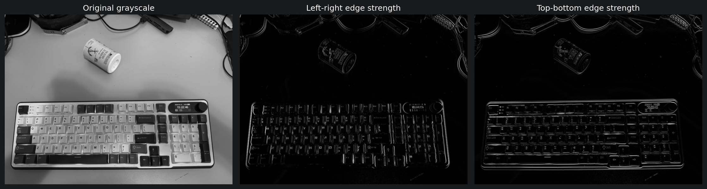
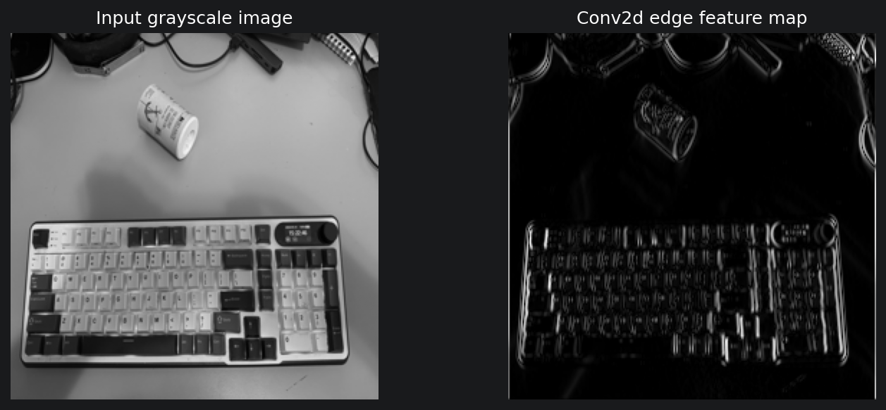
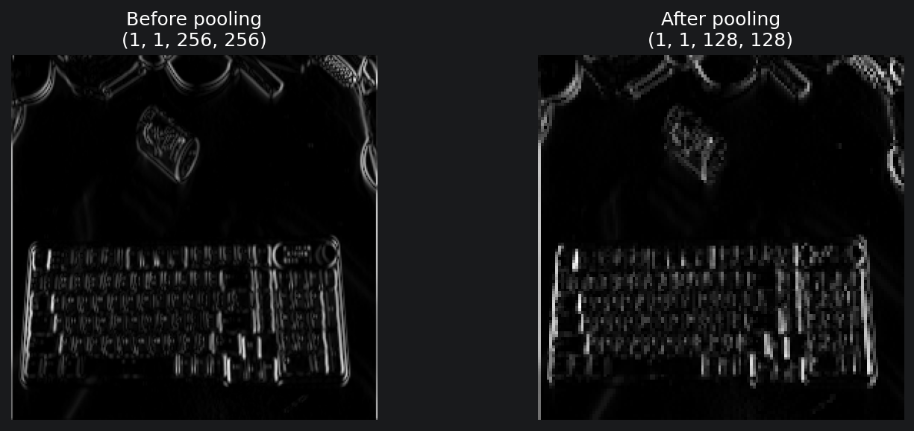
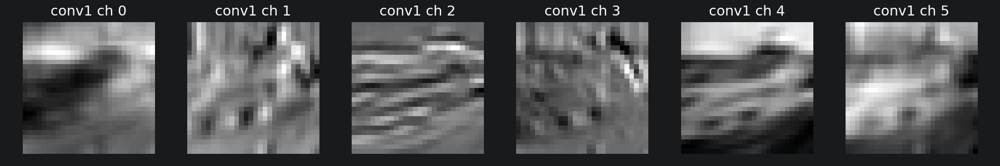
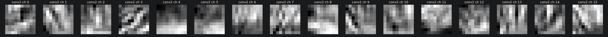
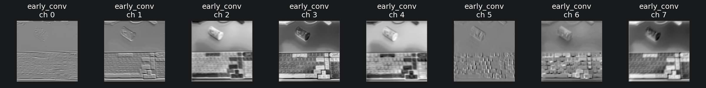
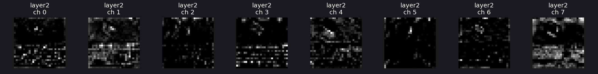

# CNN Feature Map Lab

A 5-day, learning-first PyTorch lab for understanding image convolutional networks and feature maps.

This repo is intentionally small and visual. The goal is not to chase classifier accuracy; the goal is to understand how pixels become channels, how filters produce feature maps, how pooling changes those maps, and how a tiny CNN compares with a real pretrained vision model.

## Model scale and accuracy expectations

Day 3 uses the intentionally tiny CNN from the official PyTorch CIFAR-10 tutorial: two convolution layers that create 6 then 16 feature maps, followed by a small fully connected classifier. CIFAR-10 images are only 32 by 32 pixels, so many objects are represented by coarse shapes rather than fine details. Modest accuracy is expected here because image resolution, tiny model capacity, and a short tutorial-style training run all limit classification performance. That is acceptable for this lab: accuracy is a sanity check, while the learning target is inspectable filters and feature maps.

## Learning outcome

By the end, you should be able to:

- explain convolution, RGB channels, kernels/filters, pooling, and feature maps visually;
- implement and train a tiny CNN in PyTorch;
- inspect feature maps and activations on real images;
- write a short 5-10 sentence explanation of what feature maps are.

## Official source anchors

This lab follows official PyTorch/torchvision sources where they fit, then adds small visual exercises around feature maps:

- PyTorch CIFAR-10 classifier tutorial: <https://docs.pytorch.org/tutorials/beginner/blitz/cifar10_tutorial.html>
- `torch.nn.Conv2d` docs: <https://docs.pytorch.org/docs/stable/generated/torch.nn.Conv2d.html>
- `torch.nn.MaxPool2d` docs: <https://docs.pytorch.org/docs/stable/generated/torch.nn.MaxPool2d.html>
- torchvision feature extraction docs: <https://docs.pytorch.org/vision/stable/feature_extraction.html>

## 5-day path

| Day | Focus | Main evidence |
| --- | --- | --- |
| 1 | Manual image filters | Edge/blur/sharpen output grids saved under `outputs/` |
| 2 | PyTorch `Conv2d` and pooling | Feature maps before/after pooling |
| 3 | Tiny CIFAR-10 CNN | A short training run and saved checkpoint |
| 4 | Feature-map inspection | Activations from the tiny CNN on real images |
| 5 | Pretrained CNN comparison | A few activations from a real pretrained model + final note |

## Setup

Run these commands in Windows PowerShell:

```powershell
cd $HOME\dev\cnn-feature-map-lab
uv sync
uv run python -m cnn_feature_map_lab.cuda_smoke
uv run jupyter lab notebooks
```

The project is configured to use PyTorch CUDA wheels on Windows/Linux when available. The helper code still falls back to CPU if CUDA is not available.

## Repo structure

```text
cnn-feature-map-lab/
├── notebooks/                 # one notebook per learning step
├── src/cnn_feature_map_lab/    # small typed helper functions
├── tests/                     # lightweight checks for helpers
├── data/                      # downloaded datasets or local sample images
├── outputs/                   # visual evidence and galleries
├── models/                    # tiny CNN checkpoints
└── docs/                      # implementation plan and tutorial outline
```

## Notebooks

1. `notebooks/01_manual_filters.ipynb` — make feature maps concrete with simple filters.
2. `notebooks/02_conv2d_pooling.ipynb` — connect manual filters to `torch.nn.Conv2d` and `MaxPool2d`.
3. `notebooks/03_tiny_cifar10_cnn.ipynb` — follow the official PyTorch CIFAR-10 tutorial with a tiny CNN.
4. `notebooks/04_feature_map_inspection.ipynb` — inspect activations from the tiny CNN.
5. `notebooks/05_pretrained_comparison.ipynb` — compare toy activations with a pretrained torchvision model.

## Final output gallery

| Concept | Evidence |
| --- | --- |
| Manual filter grids |  |
| `Conv2d` feature maps |  |
| Pooling before/after |  |
| Tiny CNN activations | <br> |
| Pretrained ResNet activations | <br> |

## Final feature-map explanation

A feature map is the output of a filter or convolution layer after it scans across an image. Each location in the feature map stores how strongly the filter responded to that part of the image. In the manual filter step, fixed kernels made this visible by highlighting edges, blur, or sharpened details. In PyTorch `Conv2d`, the same idea becomes learnable: the model learns filters that produce useful feature maps for the task. Pooling does not create new learned filters; it transforms existing feature maps by shrinking their spatial size and keeping strong responses. In the tiny CNN, early feature maps were easier to relate to visible edges or contrast, while later maps became smaller and harder to name. In the pretrained ResNet, early channels responded to colors and edges, while deeper channels sometimes looked more like key-like regions or composed local patterns. This showed that larger CNNs use the same basic feature-map idea, but with many more channels and more depth. The tiny CNN was useful for learning the mechanics, while the pretrained model showed how the idea scales.

## Commands used

Run these commands in Windows PowerShell:

```powershell
cd $HOME\dev\cnn-feature-map-lab
uv sync
uv run python -m cnn_feature_map_lab.cuda_smoke
uv run jupyter lab notebooks
uv run ruff check .
uv run ruff format --check .
uv run pytest
```

## Done evidence

The project is done when `outputs/` contains a small gallery with:

- manual filter grids;
- `Conv2d` feature maps;
- pooling before/after comparisons;
- tiny CNN activations;
- pretrained CNN activations;
- a short final note in your own words explaining feature maps.

The final gallery and explanation above represent each of those items.

## Quality checks

```powershell
uv run ruff check .
uv run ruff format --check .
uv run pytest
```
